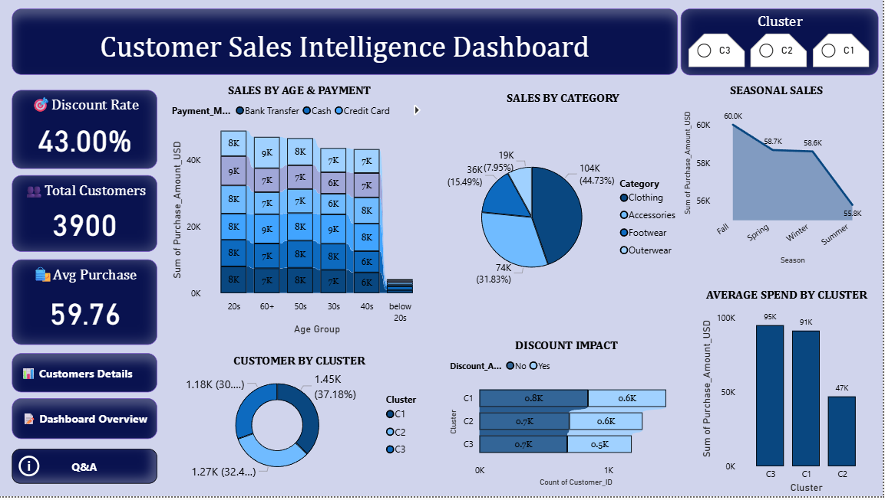

## 🎥 Dashboard key insights 
Below is the interactive Customer Sales Intelligence Dashboard dashboard created using Power BI:

📊 1. Revenue & Customer Overview

Total customers: 3,900

Average purchase value: $59.76

43% of purchases are made using discounts
👉 Discounts play a major role in driving sales.

👕 2. Category Performance

Clothing contributes the highest revenue (~45%).

Accessories contribute around 31%.

Footwear and Outerwear generate lower sales.
👉 Clothing is the main revenue driver and should be the focus for marketing and inventory planning.

👥 3. Customer Age Analysis

Customers in their 20s generate the highest sales.

50s and 60+ age groups also show strong purchasing behavior.

Below 20 segment has minimal contribution.
👉 Young adults and middle-aged customers are the primary target audience.

🌤️ 4. Seasonal Trends

Fall season shows the highest sales (~60K).

Summer records the lowest sales.
👉 Seasonal promotions before Fall can maximize revenue.

🧠 5. Customer Segmentation (Using Orange Clustering)

Cluster C3 → High-value customers (highest spending ~95K)

Cluster C1 → Medium spenders (~91K)

Cluster C2 → Low spenders (~47K)

💸 6. Discount Impact

Most clusters show strong purchase behavior during discounts.
👉 Discounts increase sales volume but need profit margin monitoring.
